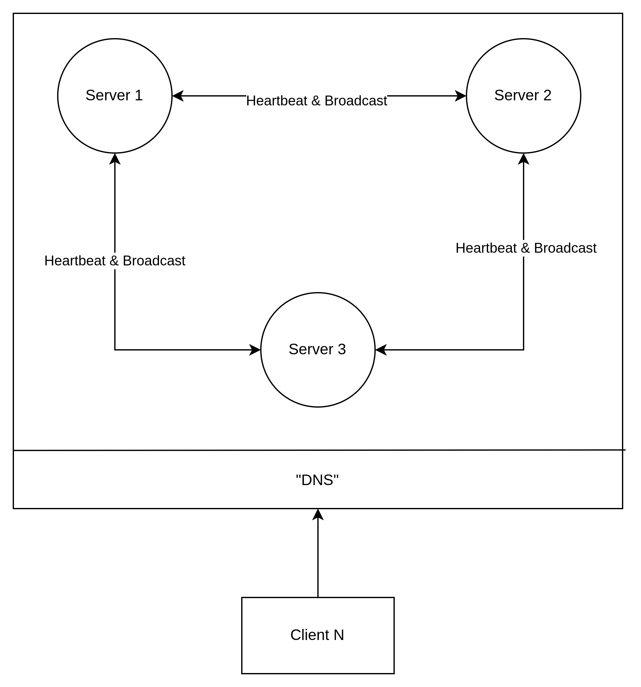

# Golang server

Servers here need a valid local DNS:

```bash
sudo bash -c 'echo "127.0.0.1 contact-server-1" >> /etc/hosts'
sudo bash -c 'echo "127.0.0.1 contact-server-2" >> /etc/hosts'
sudo bash -c 'echo "127.0.0.1 contact-server-3" >> /etc/hosts'
# Or
sudo bash -c 'echo -e "127.0.0.1 contact-server-1\n127.0.0.1 contact-server-2\n127.0.0.1 contact-server-3" >> /etc/hosts'
```

# Resources

Server structure:
 

# Connection process

## On connect:

1° byte:
  - 1 == "Server"
  - 2 == "Client"  

2-257° byte (n = 256):
  - Server or Client name

## Loop

### Server:

- 1° byte:
  - 1 == "Update"
  - 2 == "Delete"
  - 3 == "HeartBeat"
  - 4 == "UpdateClock" (OPTIONAL)
  - 5 == "AskForUpdate"

1. Update a contact:

| Name | Bytes | Example |
| --------------- | --------------- | --------------- |
| Clock | 4 | 11 |
| UserName | 256 | "Beloin" |
| ContactName | 256 | "Juan" |
| PhoneNumber | 20 | "85999999999" |

2. Delete a contact:

| Name | Bytes | Example |
| --------------- | --------------- | --------------- |
| Clock | 4 | 11 |
| UserName | 256 | "Beloin" |
| ContactName | 256 | "Juan" |


3. Hearbeat

| Name | Bytes | Example |
| --------------- | --------------- | --------------- |
| HealthStatus | 1 | 1,2,3 |
| Clock | 4 | 11 |

If __My Server's__ Clock >= __Other Server's__ Clock
  - Send "UpdateClock" command

If __My Server's__ Clock < __Other Server's__ Clock
  - Update my clock and keep listening.  

4. UpdateClock (OPTIONAL)

| Name | Bytes | Example |
| --------------- | --------------- | --------------- |
| Clock | 4 | 11 |

5. AskForUpdate

In this scenario, __My Server__ will send all contacts using the "Update Contact" command.

### Client

- 1° byte:
  - 1 == "Update"
  - 2 == "Delete"
  - 3 == "ListAll"

1. Update

| Name | Bytes | Example |
| --------------- | --------------- | --------------- |
| ContactName | 256 | "Juan" |
| PhoneNumber | 20 | "85999999999" |

2. Delete

| Name | Bytes | Example |
| --------------- | --------------- | --------------- |
| ContactName | 256 | "Juan" |


3. ListAll

Server will send:

| Name | Bytes | Example |
| --------------- | --------------- | --------------- |
| ContactLen | 4 | 11 |

And then send for each contact is send:

| Name | Bytes | Example |
| --------------- | --------------- | --------------- |
| ContactName | 256 | "Juan" |
| PhoneNumber | 20 | "85999999999" |


# Resources:

1. [Limit](https://mostafa.dev/why-do-tcp-connections-in-go-get-stuck-reading-large-amounts-of-data-f490a26a605e) TCP reading.
